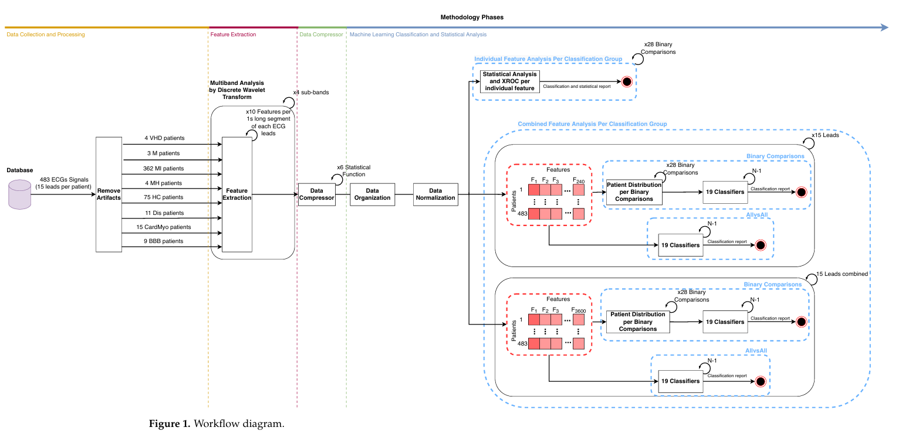

# ECG Signal Processing
<div style="float: right; margin: 0 0 10px 20px; text-align: center; max-width: 400px; border: 1px solid #ddd; padding: 5px; border-radius: 10px;">
    
    <p style="font-size: 0.9em; margin-top: 5px;"><i>Project developed within the Biomedical Signal Processing course</i></p>
</div>

Project focused on electrocardiographic (ECG) signal processing, emphasizing artifact removal and signal normalization.

**Reference Paper:**  
*Cardiovascular Diseases Diagnosis Using an ECG Multi-Band Non-Linear Analysis*

---

## Authors
 
- **Laurindo C. Benjamim** (MSc.)  
- **Bernardo Aragão Português** (MSc.)  
- **Elham Rahmaty** (MSc.)

---

## Project Workflow

<div style="float: right; margin: 0 0 10px 20px; text-align: center; max-width: 1000px; border: 1px solid #ddd; padding: 5px; border-radius: 10px;">
    
    <p style="font-size: 0.9em; margin-top: 5px;"><i>Signal processing workflow</i></p>
</div>


1. **ECG Signal Acquisition**  
   Loading of the raw signal (e.g., `.mat`, `.txt`, or PhysioNet databases).

2. **Pre-processing**  
   - Removal of *baseline wander*  
   - Band-pass filtering (0.5 Hz – 40 Hz)

3. **Artifact Removal**  
   - Motion artifacts  
   - Power-line interference (50/60 Hz)

4. **R-Peak Detection**  
   Pan-Tompkins algorithm or wavelet transform

5. **Heartbeat Segmentation**  
   Windows centered on the R-peaks

6. **Normalization**  
   - Z-score or min-max scaling  
   - Resampling to a fixed rate (e.g., 360 Hz)

---


# 📊 ECG Signal Processing - Patient Data

This repository contains ECG signals from **Patient 001** in the standard MIT-BIH format, widely used for electrocardiogram databases.

## 📁 File Structure

Each ECG record consists of three files:

| Extension | Description |
|-----------|-------------|
| **.dat** | Binary file with ECG signal data |
| **.hea** | Header file with metadata |
| **.xyz** | File with electrode lead coordinates |
| **.mat** | MATLAB format file containing processed/preprocessed signals |

### Available Files

- **Record 50010**
  - `50010_re.dat` - ECG binary data (900 KB)
  - `50010_re.hea` - Header file (2.6 KB)
  - `50010_re.xyz` - Electrode coordinates (225 KB)

- **Record 50014**
  - `50014ire.dat` - ECG binary data (2.6 MB)
  - `50014ire.hea` - Header file (2.6 KB)
  - `50014ire.xyz` - Electrode coordinates (675 KB)

- **Record 50016**
  - `50016ire.dat` - ECG binary data (2.6 MB)
  - `50016ire.hea` - Header file (2.6 KB)
  - `50016ire.xyz` - Electrode coordinates (675 KB)

## 🛠️ How to Load in MATLAB

### Prerequisites
Install the **WFDB Toolbox** for MATLAB: <a href="https://physionet.org/physiotools/matlab/wfdb-app-matlab/" target="_blank">Download available here</a>

## 🛠️ Load into MATLAB

##### Method 1: Using rdmat (Recommended)
```matlab
% Load the .dat file (name without extension)
[signal, fs, tm] = rdmat('50010_re');
```

##### Method 2: Using wfdb (Waveform Database Toolbox)
```matlab
[signal, fs] = rdsamp('50010_re');
```

##### Method 3: Manual reading
```matlab
% Read the header first
header_info = wfdbdesc('50010_re');

% Then load the signal
[signal, fs, tm] = rdsamp('50010_re', 'header', header_info);
```

##### Method 4: Loading .mat files
```matlab
% Load preprocessed MATLAB files
load('ecg_processed.mat');  % Replace with actual .mat filename

% Typical variables in .mat files:
% - ecg_signal: Processed ECG data
% - fs: Sampling frequency
% - time_vector: Time axis
% - features: Extracted ECG features
% - metadata: Signal information
```

#### 📊 Data Structure
* signal: Matrix with ECG channels (each column = one channel)

* fs: Sampling frequency (Hz)

* tm: Time vector

#### 🔍 Basic Processing Example

```matlab
% Load signal
[ecg_signal, fs, tm] = rdmat('50010_re');

% Plot the signal
figure;
plot(tm, ecg_signal);
xlabel('Time (s)');
ylabel('Amplitude');
title('ECG Signal - Patient 001');
grid on;

% Basic information
fprintf('Sampling frequency: %d Hz\n', fs);
fprintf('Signal duration: %.2f seconds\n', tm(end));
fprintf('Number of channels: %d\n', size(ecg_signal, 2));
```

#### 💾 Saving Processed Data as .mat
```matlab % After processing, save as .mat for faster loading
ecg_processed = ecg_signal;  % Your processed signal
sampling_rate = fs;
time_axis = tm;
patient_info = 'Patient001_Record50010';

save('ecg_processed.mat', 'ecg_processed', 'sampling_rate', 'time_axis', 'patient_info');
```

### Pre-requisits
Instale a **WFDB Toolbox** para MATLAB:
```matlab
% Download disponível em: 
% https://physionet.org/physiotools/matlab/wfdb-app-matlab/


## MATLAB Code Example

```matlab
% Load ECG signal
load('ecg_signal.mat');

% Band-pass filtering (0.5 - 40 Hz)
fs = 360; % Sampling frequency
[b, a] = butter(4, [0.5/(fs/2) 40/(fs/2)], 'bandpass');
ecg_filt = filtfilt(b, a, ecg);

% Baseline removal
ecg_baseline = filtfilt(butter(4, 0.5/(fs/2), 'high'), 1, ecg_filt);
ecg_clean = ecg_filt - ecg_baseline;

% Z-score normalization
ecg_norm = (ecg_clean - mean(ecg_clean)) / std(ecg_clean);

% Plot
figure; plot(ecg_norm); 
title('Normalized ECG Signal'); 
xlabel('Samples'); ylabel('Amplitude');